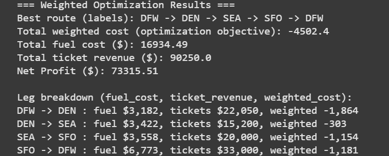

# Q³ Hackathon – Ket Going

🚀 *First Quantum Hackathon in California, hosted at USC under Q³, supported by IBM.*

---

## 🌍 About the Hackathon
The convergence of **quantum science** and **global sustainability** is unlocking new horizons of possibility. Quantum computing offers transformative tools for achieving the **UN’s Sustainable Development Goals**, enabling powerful approaches to **simulation, optimization, and computation**. 

At the **Q³ Hackathon**, teams are challenged to explore how quantum can address real-world issues across three tracks:  
- **Reversible Computing**  
- **Quantum Optimization for Impact**  
- **Quantum Chemistry for Sustainable Technologies**  

We participated in **Track 2: Quantum Optimization for Impact**, applying **quantum optimization algorithms** to sustainability challenges.  

---

## ✈️ Our Project: Ket Going
**Problem:**  
The aviation industry is a significant contributor to global carbon emissions. Optimizing **flight routing, passenger allocation, and fuel efficiency** can help reduce its environmental impact.  

**Solution:**  
We modeled the **Traveling Salesman Problem (TSP)** using **Qiskit** and implemented the **Quantum Approximate Optimization Algorithm (QAOA)** to optimize flight routes.  
- Minimized **fuel consumption** across multiple city routes.  
- Balanced **passenger loads** while reducing environmental costs.  
- Incorporated **ticket pricing** and **user-defined weight preferences** for sustainability vs. revenue trade-offs.  
- Showed how quantum algorithms can support **sustainable aviation practices** by reducing emissions.  

  
## 📊 Results
Here’s an example output from our optimization run:  

  
In the above result, the path shown represents the one with the lowest overall weight, considering both fuel consumption and revenue. In this context, the weight reflects our emphasis on sustainability (thus higher on fuel), aiming to prioritize routes that connect all the locations in a way that minimizes environmental impact.

This project demonstrates the potential of **quantum optimization** to solve real-world logistical challenges in transportation and climate action.  

---

## 🛠️ Tech Stack
- **Qiskit** (IBM Quantum SDK)  
- **Python 3**  
- **IBM Quantum Hardware Access**
-  **Frontend (separate branch)** for user input interface for the weights, passenger, and ticket prices

---

## 📚 How to Get Started

### 1. Install Qiskit
Follow IBM’s official setup guide:  
👉 [Qiskit Install Guide](https://qiskit.org/documentation/getting_started.html)  

Or watch this tutorial:  
👉 [How to Install Qiskit | Coding with Qiskit 1.x](https://www.youtube.com/watch?v=ZtWbzRLQ4VQ)  

### 2. Use an Online Environment
For an easy setup (especially on Windows), try:  
👉 colab or any notbook 

### 3. Run Our Code
Clone this repo and install dependencies:  
```bash
git clone https://github.com/BilinP/Q3-Hackathon-Ket-Going.git
cd Q3-Hackathon-Ket-Going
